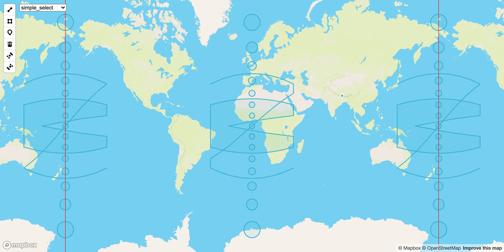
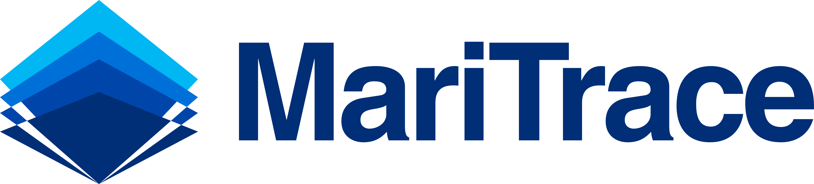

# mapbox-gl-draw-geodesic

[](https://www.npmjs.com/package/mapbox-gl-draw-geodesic)
[](https://www.npmjs.com/package/mapbox-gl-draw-geodesic)
[](https://www.npmjs.com/package/mapbox-gl-draw-geodesic)

Geodesic plugin for Mapbox GL Draw to draw geodesic lines, polygons and circles. Geodesic calculations are isolated inside the plugin, keeping the developer using the plugin abstracted away from the calculations.

[Demo](https://zakjan.github.io/mapbox-gl-draw-geodesic/)



Supported Mapbox GL Draw modes:

- draw_line_string
- draw_polygon
- draw_circle
- draw_point
- simple_select
- direct_select
- static

## Install

```
npm install mapbox-gl-draw-geodesic
```

or

```
<script src="https://unpkg.com/mapbox-gl-draw-geodesic@2.2.3/dist/mapbox-gl-draw-geodesic.umd.min.js"></script>
```

## Usage

This plugin exposes a single function `enable`, which should be used to patch the original `MapboxDraw.modes` object.

```
import MapboxDraw from 'mapbox-gl-draw';
import * as MapboxDrawGeodesic from 'mapbox-gl-draw-geodesic';

let modes = MapboxDraw.modes;
modes = MapboxDrawGeodesic.enable(modes);
const draw = new MapboxDraw({ modes });
```

The usual Mapbox GL Draw events are fired.

The patching method is compatible with [mapbox-gl-draw-waypoint](https://github.com/zakjan/mapbox-gl-draw-waypoint), both patches can be used together.

```
import MapboxDraw from 'mapbox-gl-draw';
import * as MapboxDrawGeodesic from 'mapbox-gl-draw-geodesic';
import * as MapboxDrawWaypoint from 'mapbox-gl-draw-waypoint';

let modes = MapboxDraw.modes;
modes = MapboxDrawGeodesic.enable(modes);
modes = MapboxDrawWaypoint.enable(modes);
const draw = new MapboxDraw({ modes });
```

### Circle GeoJSON

Unfortunately GeoJSON officially doesn't support circle geometries. This library uses a custom GeoJSON format to be able to represent circles drawn on the map. The format was chosen experimentally, so that it plays well with Mapbox GL Draw internal architecture. Other formats were also considered. The current format is:

```
{
  type: 'Feature',
  properties: {
    circleRadius: radius // km
  },
  geometry: {
    type: 'Polygon',
    coordinates: [[center, center, center, center]] // valid polygon needs 3 vertices
  }
}
```

To future-proof your code from potential format changes, use exposed helper methods to work with circle GeoJSONs.

- createCircle(center, radius, properties?)
- isCircle(geojson)
- getCircleCenter(geojson)
- setCircleCenter(geojson, center)
- getCircleRadius(geojson)
- setCircleRadius(geojson, radius)

```
// create
const circle = MapboxDrawGeodesic.createCircle([0, 0], 100);
draw.add(circle);

// update
MapboxDrawGeodesic.setCircleCenter(circle, [10, 10]);
MapboxDrawGeodesic.setCircleRadius(circle, 200);
draw.add(circle);

map.on('draw.create', (event) => {
  const geojson = event.features[0];
  console.log('create', geojson);

  // read
  if (MapboxDrawGeodesic.isCircle(geojson)) {
    const center = MapboxDrawGeodesic.getCircleCenter(geojson);
    const radius = MapboxDrawGeodesic.getCircleRadius(geojson);
    console.log('circle', 'center', center, 'radius', radius);
  }
});
```

### Static mode

If you need to render geodesic map features without using the drawing capabilities, create Mapbox GL Draw with the static mode only. Then you can add your features to Mapbox GL Draw instance to render them as geodesic.

```
const draw = new MapboxDraw({
  modes: {
    static: MapboxDrawGeodesic.modes.static
  }
});

draw.add({
  type: 'Feature',
  properties: {},
  geometry: {
    type: 'LineString',
    coordinates: [[-40, 37.5], [40, 37.5], [40, 30], [-40, -30], [-40, -37.5], [40, -37.5]]
  }
});
```

## Sponsors

<a href="https://maritrace.com/"></a>
